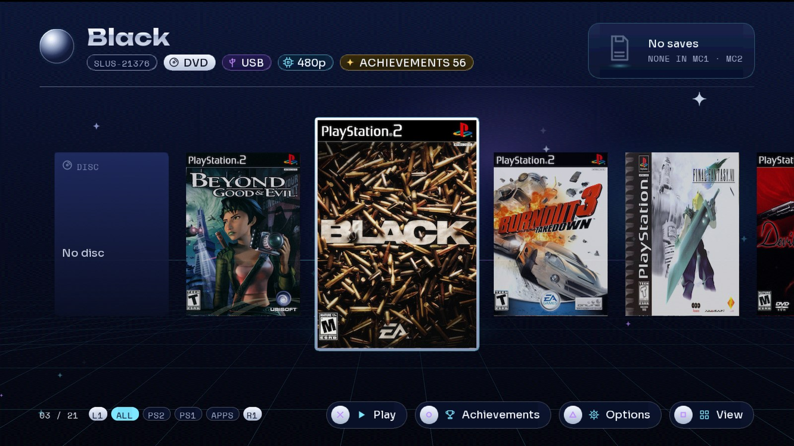

# ORBIT — a game launcher for the PlayStation 2

ORBIT is a launcher that runs on a real PS2. It lists your games with their covers, starts them through
[Neutrino](https://github.com/rickgaiser/neutrino), and adds what a modern console menu has: covers downloaded by the
console itself, 3D save icons, virtual memory cards per game, an in-game menu, games served from a home server, and
RetroAchievements on real hardware. Spanish and English.

**Website, screenshots and videos:** https://danielnuld.github.io/ps2-launcher/
**Download:** [latest release](https://github.com/danielnuld/ps2-launcher/releases/latest)



## Features

- **Three views** of your library (carousel, grid, list) at 60 frames per second, with filters (All, PS2, PS1, Apps)
  and an animated splash. Measured on the console: a median frame takes under 5 ms of the 16.7 ms budget.
- **Covers downloaded by the PS2**, over HTTPS from [xlenore/ps2-covers](https://github.com/xlenore/ps2-covers),
  decoded and dithered on the console, saved to the USB. No PC step.
- **3D save icons**: the newest save of each game, read from the memory card, spinning on the detail card.
- **Every source Neutrino knows**: USB, internal HDD (exFAT or HD Loader), MX4SIO, iLink, MMCE, UDPBD, and a
  **home game server** (udpfs + ORBIT's catalog service) whose games list instantly and keep every feature.
- **Virtual memory cards**, one per game (or one shared), created on first play, on the game's own device.
- **Per-game options** (△): video mode forced to 480p or 1080i, compatibility modes, memory card.
- **In-game menu**: hold L1+L2+R1+R2+START+SELECT in any game to pause it and restart or power off; plus direct
  restart and power-off combos (In Game Reset).
- **RetroAchievements on the console**: the launcher identifies each game (rcheevos-compatible hash), shows how many
  achievements it has (○ opens the full list with your progress), and while you play an agent inside the game streams
  its memory to the [xeRAbora](https://github.com/hacan359/xerabora) client on your home network, which unlocks the
  achievements on your profile.
- **Discs, PS1 and apps**: boots the disc in the drive, PS1 games through POPStarter, and homebrew from `APPS/`.
- **Spanish or English** (`config.ini [ui] idioma`), including the in-game menu and the config file's comments.
- Companion app: [ORBIT Jellyfin](https://github.com/danielnuld/orbit-jellyfin), your Jellyfin library on the PS2.

## Quick start

1. **Copy** the release zip's contents to the root of a FAT32 or exFAT USB drive: `launcher.elf` and `neutrino/`.
   Put your PS2 ISOs in `DVD/` (and CD games in `CD/`).
2. **Start** `mass0:/launcher.elf` from uLaunchELF or FreeMcBoot (for example as FMCB's autoboot).
3. **Play**: pick a game, press ✕. The first boot writes `mass0:/orbit/config.ini`, commented, with every setting.

Optional:
- **Covers**: plug in the network cable; missing covers download at boot.
- **Back to ORBIT from a game**: the launcher installs `BOOT/ORBIT.ELF` on your memory card; point FMCB's autoboot
  at it so "Restart" in the in-game menu brings you back.
- **Achievements**: run the [xeRAbora](https://github.com/hacan359/xerabora) client (signed in to your
  RetroAchievements account) on a PC or server on the same network.
- **Home game server**: on a Linux box, run Neutrino's `udpfs_server.py` and ORBIT's `server/orbit_catalog.py`
  (zip, `server/`) over `<root>/DVD`; set `[juegos] origen = usb, udpfs` and `servidor = <server IP>`. Use a cable.

The full guide is on the [website](https://danielnuld.github.io/ps2-launcher/#guide) and in the setup video.

## Requirements

- A PS2 that can run homebrew (FreeMcBoot or similar). Tested on a slim SCPH-75001.
- A USB drive (FAT32; exFAT for ISOs over 4 GB).
- Network (optional): built-in Ethernet on slim models, the network adapter on fat ones. Wired.

## Building

Toolchain: [ps2dev](https://github.com/ps2dev/ps2dev) v2.0 (with the wolfSSL and libjpeg ports) on Linux or WSL.

```
./build.sh APP=launcher          # launcher.elf
./build.sh test                  # host selftests
tools/build_neutrino.sh          # the Neutrino fork: neutrino.elf, ee_core.elf, raagent.irx (dist/neutrino)
./build.sh orbit_hash            # the game server's helper (static)
```

How it was built, phase by phase, is in `openspec/` (specs and archived changes) and `docs/` (results measured on
the console).

## Credits

- [Neutrino](https://github.com/rickgaiser/neutrino) by Maximus32 (AFL-3.0), which loads the games; ORBIT ships a
  fork with the in-game menu and the achievements agent (`third_party/neutrino-igr`, AFL-3.0).
- [Open PS2 Loader](https://github.com/ps2homebrew/Open-PS2-Loader) (AFL-3.0): the In Game Reset technique.
- [xeRAbora](https://github.com/hacan359/xerabora) (MIT client): the RetroAchievements protocol and PC client;
  [rcheevos](https://github.com/RetroAchievements/rcheevos) (MIT): the hash algorithm.
- [ps2sdk](https://github.com/ps2dev/ps2sdk), wolfSSL, libjpeg; covers from
  [xlenore/ps2-covers](https://github.com/xlenore/ps2-covers); fonts Unbounded, Sora, Space Mono (SIL OFL).
- Developed with [Claude Code](https://claude.com/claude-code) (Anthropic) as the coding assistant, with the
  OpenSpec, Ponytail and CodeGraph plugins.

## License

GPL-3.0 (the launcher statically links wolfSSL, GPL-3.0+). The Neutrino fork in `third_party/neutrino-igr` is
AFL-3.0, as Neutrino.
